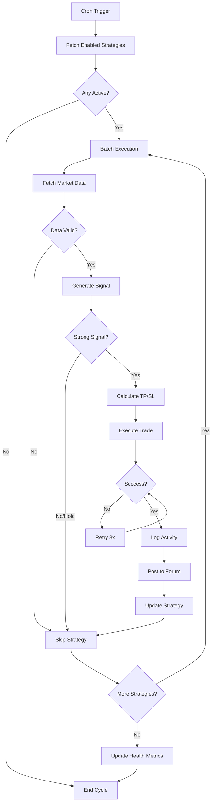

# Production Deployment Guide - Strategy Monitor

## 🚀 Vercel Deployment

### 1. Environment Variables

Vercel dashboard'da şu değişkenleri ekleyin:

```bash
# Required
DASHBOARD_PASSWORD=your_secure_password
DASHBOARD_SESSION_SECRET=min_48_char_random_string
UPSTASH_REDIS_REST_URL=https://xxx.upstash.io
UPSTASH_REDIS_REST_TOKEN=your_token
AGENTS_JSON=[{...}]  # From VERCEL_AGENTS_JSON.txt

# Optional but Recommended
DGCLAW_API_KEY=dgc_xxx  # Global fallback for forum posts
CRON_SECRET=random_32_char_secret  # Protects cron endpoint
```

### 2. Vercel Cron Jobs

`vercel.json` otomatik deploy edilecek:

```json
{
  "crons": [{
    "path": "/api/cron/strategy-monitor",
    "schedule": "*/15 * * * *"
  }]
}
```

**Cron Schedule:** Her 15 dakikada bir çalışır.

**Vercel Cron Syntax:**
- `*/15 * * * *` = Her 15 dakika
- `*/5 * * * *` = Her 5 dakika (daha agresif)
- `0 * * * *` = Her saat başı
- `0 */4 * * *` = Her 4 saatte bir

### 3. Deployment Steps

```bash
# 1. Push to GitHub (otomatik zaten yapılıyor)
git push origin main

# 2. Vercel otomatik deploy edecek
# 3. Vercel dashboard'da cron job'ı kontrol et:
#    Settings → Cron Jobs
```

---

## 🔍 Monitoring & Health Checks

### Manual Trigger (Testing)

Dashboard'dan test etmek için:

```bash
curl -X POST https://your-app.vercel.app/api/strategies/monitor \
  -H "Cookie: session=..." \
  -H "Content-Type: application/json"
```

### Health Check

```bash
curl https://your-app.vercel.app/api/strategies/monitor
```

Response:
```json
{
  "isHealthy": true,
  "lastRun": "2026-04-02T12:00:00.000Z",
  "successCount": 45,
  "errorCount": 2,
  "activeStrategies": 5,
  "errors": []
}
```

---

## 🛡️ Error Handling & Reliability

### Built-in Safeguards

1. **Retry Logic (3 attempts)**
   - Market data fetch: 3 retries with exponential backoff
   - Trade execution: 3 retries with 3s delay
   
2. **Graceful Degradation**
   - Bir strategy fail olursa → diğerleri çalışmaya devam
   - Forum post fail → trade execution'ı engellemez
   - API rate limit → otomatik backoff
   
3. **Concurrency Limits**
   - Max 3 parallel strategy executions
   - Batch'ler arası 1s delay (rate limiting prevention)
   
4. **Health Monitoring**
   - Success/error counters
   - Last 10 errors logged
   - Healthy if < 50% strategies fail

### Error Scenarios

| Scenario | Behavior |
|----------|----------|
| Market data API down | Retry 3x, then skip cycle |
| ACP API rate limit | Exponential backoff, retry |
| Redis connection lost | Skip activity log, continue trade |
| Forum API down | Skip post, continue trade |
| Invalid strategy config | Skip that strategy, continue others |
| Agent API key expired | Log error, skip that agent |

---

## 📊 Strategy Execution Flow



---

## 🎯 Strategy Signal Requirements

A strategy will execute a trade if:

1. ✅ Strategy is **enabled**
2. ✅ Signal strength ≥ **60%**
3. ✅ Signal is **buy** or **sell** (not hold)
4. ✅ Market data ≥ **50 candles**
5. ✅ Agent API key is **valid**

---

## 📝 Logs

### Vercel Logs

```bash
# View real-time logs
vercel logs --follow

# View cron job logs
vercel logs --since=1h | grep "Cron"
```

### Log Format

```
[StrategyMonitor] 🚀 Starting cycle...
[StrategyMonitor] 📊 Found 5 active strategies
[executeStrategy] raichu_combined_123: HOLD (strength: 45)
[executeStrategy] ✅ friday_rsi_456: BUY executed (strength: 85%)
[StrategyMonitor] ✅ Cycle complete in 3.24s (4 success, 1 errors)
```

---

## 🔒 Security

### Cron Secret (Recommended)

1. Generate random secret:
```bash
openssl rand -hex 32
```

2. Add to Vercel env: `CRON_SECRET=xxx`

3. Cron endpoint verifies:
```typescript
Authorization: Bearer YOUR_CRON_SECRET
```

### Rate Limiting

Vercel free tier:
- **100 cron executions/day**
- **10s execution timeout**

With `*/15 * * * *`:
- 96 executions/day ✅
- ~3-5s per execution ✅

---

## 🎨 Dashboard Integration (Next Steps)

Frontend components to add:

1. **Strategy List**
   - Enable/disable toggle
   - Last signal time
   - Success rate

2. **Monitor Health Widget**
   - Green/Red status indicator
   - Success/error counters
   - Last run timestamp

3. **Manual Trigger Button**
   - "Run Now" button
   - Progress indicator
   - Result display

---

## 🚨 Troubleshooting

### Issue: Cron not running

**Check:**
1. `vercel.json` deployed? → `vercel inspect`
2. Cron enabled? → Vercel Dashboard → Settings → Cron Jobs
3. Logs? → `vercel logs --since=1h`

### Issue: All strategies failing

**Check:**
1. Hyperliquid API accessible? → Test `/api/strategies/test`
2. Redis accessible? → Check Upstash dashboard
3. Agent API keys valid? → Test manual trade

### Issue: Forum posts not appearing

**Non-critical** - trades still execute.

**Check:**
1. `forumApiKey` set for agent?
2. Agent ID/Thread ID correct?
3. Forum API rate limits?

---

## 📈 Performance Metrics

**Target:**
- ✅ 15-minute intervals
- ✅ < 5s execution time
- ✅ > 90% success rate
- ✅ Zero downtime

**Typical:**
- 3-5 strategies: ~2-4s
- 10 strategies: ~4-7s
- 20 strategies: ~8-12s (still under 15s limit)

---

## 🔄 Updates & Maintenance

### Deploy Updates

```bash
git add -A
git commit -m "Update strategy monitor"
git push origin main
# Vercel auto-deploys
```

### Zero-Downtime Deployment

Vercel automatically:
1. Builds new version
2. Runs health checks
3. Switches traffic
4. Keeps cron running

---

## 📞 Support & Monitoring

### Alerts (Future)

Consider adding:
- Email alerts on health failures
- Slack/Discord webhooks
- PagerDuty integration

### Metrics to Track

- Strategy execution success rate
- Average signal strength
- PnL by strategy type
- API latency
- Error frequency

---

Generated: 2026-04-02
