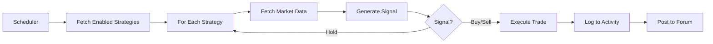

# Trading Strategy System - Technical Documentation

## Ş İmplementasyonlar

Sisteminize **TrendTrader** benzeri otomatik trading stratejileri ekledim! 🎯

## 📚 Yapı

### 1. **İndikatör Kütüphanesi** (`src/lib/indicators/`)

#### `calculations.ts` - Teknik Analiz Fonksiyonları
- ✅ **RSI** (Relative Strength Index)
- ✅ **EMA** (Exponential Moving Average)
- ✅ **SMA** (Simple Moving Average)
- ✅ **MACD** (Moving Average Convergence Divergence)
  - MACD Line
  - Signal Line
  - Histogram
- ✅ **Bollinger Bands**
- ✅ **RSI Divergence Detection**
- ✅ **Crossover Detection** (EMA/MACD crosses)

#### `types.ts` - Strateji Tanımları
6 farklı strateji tipi:
1. **RSI Reversal** - RSI oversold/overbought
2. **EMA Cross** - Golden/Death cross
3. **MACD Histogram** - Histogram flip signals
4. **MACD Crossover** - MACD/Signal line crosses
5. **TrendTrader Combined** - Multi-indicator scoring system
6. **RSI Divergence** - Bullish/Bearish divergence

#### `engine.ts` - Sinyal Motoru
Her strateji için:
- Candle verilerinden sinyal üretimi
- Buy/Sell/Hold kararı
- Sinyal gücü (0-100)
- Detaylı açıklama

**TrendTrader Combined** özel özellikleri:
- 4+ indikatör aynı anda analiz eder
- Skorlama sistemi (voting mechanism)
- `requireAll: true` → Tüm indikatörler aynı yönde olmalı
- `requireAll: false` → Çoğunluk oyu (varsayılan)

#### `market-data.ts` - Market Verisi
- Hyperliquid'den candle çekme
- Desteklenen aralıklar: 1m, 5m, 15m, 30m, 1h, 4h, 1d, vb.

#### `storage.ts` - Redis Storage
- Stratejileri kaydetme/yükleme
- Agent bazında filtreleme
- Enable/disable toggle

### 2. **API Routes**

#### `/api/strategies`
- `GET ?agent=alias` - Agent'ın stratejilerini getir
- `GET` (without params) - Tüm aktif stratejileri getir
- `POST` - Yeni strateji oluştur
- `PUT` - Stratejiyi güncelle
- `DELETE ?id=...&agent=...` - Stratejiyi sil

#### `/api/strategies/test`
- `POST { strategyId, pair }` - Stratejiyi gerçek zamanlı test et
- Mevcut market verisini kullanır
- Sinyal üretir ve döner

### 3. **Kullanım Örneği**

```typescript
// 1. Strateji oluştur
const strategy: StrategyConfig = {
  id: "raichu_rsi_1234567890",
  agentAlias: "raichu",
  strategyType: "rsi_reversal",
  enabled: true,
  tickInterval: "15m",
  candleInterval: "15m",
  positionSizeUSD: 100,
  leverage: 3,
  takeProfitPercent: 3.5,
  stopLossPercent: 3,
  parameters: {
    period: 14,
    oversold: 30,
    overbought: 70
  },
  createdAt: "2026-04-02T..."
};

// 2. Kaydet
await saveStrategy(strategy);

// 3. Market verisini çek
const candles = await fetchCandles({
  pair: "BTC",
  interval: "15m",
  limit: 100
});

// 4. Sinyal üret
const signal = generateSignal(candles, strategy, "BTC");

// signal = {
//   strategyId: "raichu_rsi_1234567890",
//   agentAlias: "raichu",
//   pair: "BTC",
//   signal: "buy",  // or "sell" or "hold"
//   strength: 75,   // 0-100
//   reason: "RSI oversold (28.5)",
//   indicators: { rsi: 28.5 },
//   timestamp: "2026-04-02T..."
// }

// 5. Eğer sinyal buy/sell ise, işlem aç
if (signal.signal !== "hold" && signal.strength > 60) {
  await jobPerpOpen(client, {
    pair: signal.pair,
    side: signal.signal === "buy" ? "long" : "short",
    size: strategy.positionSizeUSD.toString(),
    leverage: strategy.leverage,
    takeProfit: calculateTP(price, strategy.takeProfitPercent, side),
    stopLoss: calculateSL(price, strategy.stopLossPercent, side),
  });
}
```

## 🎨 Frontend UI (Sonraki Adım)

Şu özellikleri ekleyeceğiz:
1. **Strategy Creator Modal**
   - Agent seçimi
   - Strateji tipi seçimi (dropdown)
   - Parametre ayarları (tick interval, leverage, TP, SL)
   - Strategy-specific parameters
2. **Strategy List Component**
   - Active/inactive toggle
   - Edit/Delete
   - Test button (manual signal check)
3. **Live Signal Monitor**
   - Real-time signal feed
   - Auto-execute toggle

## 🤖 Telegram Bot Entegrasyonu

Yeni komutlar eklenecek:
```
/strategy create raichu rsi_reversal
/strategy list raichu
/strategy enable <id>
/strategy disable <id>
/strategy test <id> BTC
```

## 📊 Strateji Parametreleri

### RSI Reversal
- `period`: RSI periyodu (varsayılan: 14)
- `oversold`: Aşırı satım seviyesi (varsayılan: 30)
- `overbought`: Aşırı alım seviyesi (varsayılan: 70)

### EMA Cross
- `fastPeriod`: Hızlı EMA (varsayılan: 9)
- `slowPeriod`: Yavaş EMA (varsayılan: 21)

### MACD
- `fastPeriod`: Hızlı EMA (varsayılan: 12)
- `slowPeriod`: Yavaş EMA (varsayılan: 26)
- `signalPeriod`: Sinyal hattı (varsayılan: 9)

### TrendTrader Combined
- RSI + EMA + MACD + Divergence birleşimi
- `requireAll`: true/false (tüm indikatörler aynı yönde mi?)

## 🔄 Otomasyon Akışı



## 🚀 Deployment

1. **Backend hazır** - Tüm indicator ve engine kodları yazıldı
2. **API routes hazır** - `/api/strategies` endpoints eklendi
3. **Sonraki adım**: Frontend UI komponenti + Scheduler

---

İlgili Dosyalar:
- `src/lib/indicators/calculations.ts` - Pure TS indicators
- `src/lib/indicators/types.ts` - Type definitions
- `src/lib/indicators/engine.ts` - Signal generator
- `src/lib/indicators/market-data.ts` - Candle fetcher
- `src/lib/indicators/storage.ts` - Redis CRUD
- `src/app/api/strategies/route.ts` - CRUD endpoints
- `src/app/api/strategies/test/route.ts` - Test endpoint
